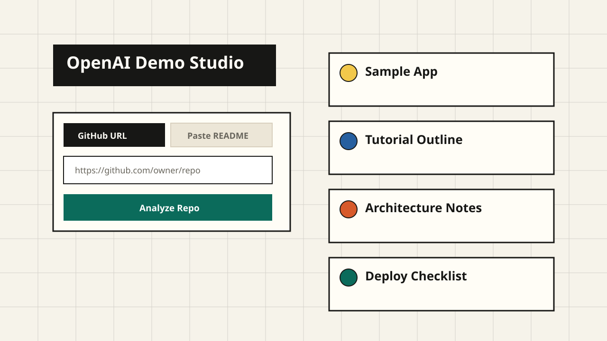

# OpenAI Demo Studio

OpenAI Demo Studio turns a GitHub repository URL or pasted README into an immersive developer demo lab. It generates a repo x-ray, three OpenAI demo paths, an architecture blueprint, a starter code pack, exportable Markdown, and a presentation-ready pitch.



## How It Works

1. Paste a public GitHub repository URL or paste raw README markdown.
2. For GitHub URLs, the app fetches `README.md` from the repo's `main` branch, then falls back to `master`.
3. The README text is truncated to 8,000 characters and sent to `/api/analyze`.
4. The UI shows an analysis timeline while the app fetches, detects, designs, builds, and saves.
5. `/api/analyze` calls the OpenAI Responses API with a strict JSON schema.
6. The app renders a dashboard with Overview, Blueprint, Starter Pack, and Presentation tabs.
7. The generation is saved in Supabase so it can appear in the recent history panel.

## OpenAI APIs Used

The app uses the OpenAI Responses API because it is the current unified API for generating model responses and supports structured JSON output from the same endpoint. The model is configured as `gpt-4o` because the product needs strong developer-facing writing, reasoning over README content, and reliable structured output.

The route uses `text.format.type = "json_schema"` so the response matches the expected object shape:

```ts
{
  repoXray: { framework, language, repoType, detectedFeatures },
  demoPaths: [
    { id, label, sampleApp, blueprint, starterPack, presentation }
  ],
  selectedPath: "portfolio",
  apiMatch: [{ api, fit, score, reasoning }]
}
```

## Immersive Features

1. The analysis timeline shows the current stage and the exact stage that failed.
2. Repo X-Ray summarizes the framework, language, repo type, setup quality, deploy readiness, and detected features.
3. Choose Your Demo Path lets you switch between Quick Win, Portfolio-Worthy, and Production-Grade without another API call.
4. Blueprint shows the user flow, frontend, backend, OpenAI layer, storage, and deployment as an architecture map.
5. Starter Pack gives files to create, install commands, environment variables, implementation steps, and code snippets.
6. Presentation Mode opens a full-screen pitch view for the generated demo.
7. Export actions copy Markdown, download Markdown, or copy a GitHub issue body.

## Local Setup

1. Install dependencies.

```bash
bun install
```

2. Copy the environment file.

```bash
cp .env.example .env.local
```

3. Add your environment variables.

```bash
OPENAI_API_KEY=sk-...
OPENAI_MODEL=gpt-5-mini-2025-08-07
NEXT_PUBLIC_SUPABASE_URL=https://your-project.supabase.co
NEXT_PUBLIC_SUPABASE_ANON_KEY=your-anon-key
```

`OPENAI_MODEL` is optional. If it is empty, the app uses the default model configured in `src/lib/openai.ts`.

4. Create the Supabase table with either path:

```bash
supabase db push
```

or run the SQL in `supabase/schema.sql` inside the Supabase SQL editor.

5. Start the app.

```bash
bun dev
```

6. Open `http://localhost:3000`, paste a public repo URL, and analyze it.

## Supabase Table

The app stores generations in a single public table:

```sql
create extension if not exists pgcrypto;

create table if not exists public.generations (
  id uuid primary key default gen_random_uuid(),
  created_at timestamptz not null default now(),
  repo_url text,
  readme_snippet text not null,
  generation jsonb,
  sample_app jsonb not null,
  tutorial_outline jsonb not null,
  architecture_notes jsonb not null,
  deploy_checklist jsonb not null
);
```

For v1, history is public. Use the migration in `supabase/migrations` or the full SQL in `supabase/schema.sql` to add the canonical `generation` JSON column, keep the legacy columns, and enable row level security with explicit public read and insert policies for the anon role.

## Deploy To Vercel

1. Push the repo to GitHub.
2. Import the repo in Vercel.
3. Set the same three environment variables in the Vercel project settings.
4. Deploy with the default Next.js settings.
5. After deploy, test both input modes and confirm the history sidebar shows saved generations.

The repo includes `vercel.json` so Vercel uses Bun for install and build:

```bash
vercel env add OPENAI_API_KEY
vercel env add OPENAI_MODEL
vercel env add NEXT_PUBLIC_SUPABASE_URL
vercel env add NEXT_PUBLIC_SUPABASE_ANON_KEY
vercel deploy --prod
```

## Project Scripts

```bash
bun dev
bun run typecheck
bun run build
```

## Definition Of Done

- `bun install` runs clean.
- TypeScript passes with no errors.
- The app runs on `localhost:3000`.
- GitHub URL input fetches a real README.
- `/api/analyze` returns valid structured JSON for that README.
- Repo x-ray, demo paths, blueprint, starter pack, presentation mode, and export actions render correctly.
- Generation saves to Supabase.
- History sidebar shows past generations.
- Vercel has the required environment variables.
- The README explains the app as a tutorial.
- The repo is public on GitHub.
